# Dublin bike station occupancy prediction

**Introduction**:

This project aims at evaluating the feasibility of predicting bike station occupancies in the future. The prediction results obtained from the method used will be compared with a baseline model to evaluate the results. For this project I have done the analysis for Hanover Quay station. I will try to predict the bike station occupancy 60 minutes in the future.

Baseline: 

For the baseline, I will be using the prediction that the number of bikes after 60 mins is same as it in the current time.

**Data Preparation:**

For this assignment, the Dublin Bikes 2020 Q1 usage data was obtained from this website. This file contains data from 1st January to 1st April 2020.

**Analysis of Data:**

Figure below shows the plot of available bikes for different days from 1st January to 1st April. For the days to the left of the red line, there are missing data entries. Hence these data will be filtered out. The data to the right of the black line has a very different pattern. The usage has considerably reduced. This difference in pattern is because of the effects of the Covid 19 lockdown introduced in Dublin. This data will be removed too. Hence we will be selecting only the data from 28th January to 14th March 2020.

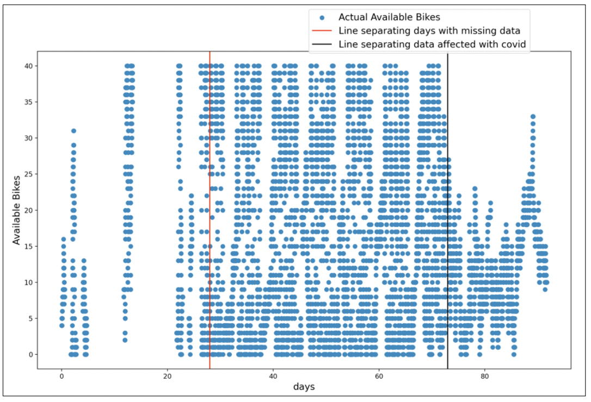

Figure below shows the bike availability data for 2 weeks. From figure 2, days 4, 5 11, 12 have very low usage and also a very different pattern of usage. This is because these are weekends. If we use the same model to train both the weekend and weekday data, we will not be getting accurate results. We will need to use different features for weekdays and weekends. Hence we will be training both of these data separately.

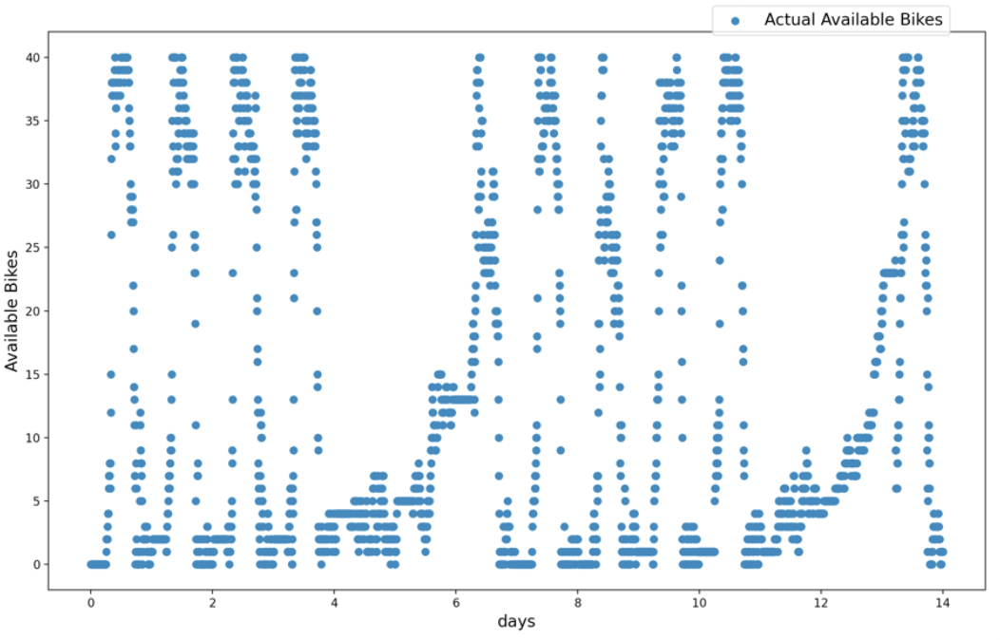

**Process Followed:**

Figure below shows the process followed in this report for predicting the bike station occupancies. Once the data is filtered based on date, the entire data is split into data for weekends and weekdays. Separate features are selected for both weekend and weekdays and then a separate model is trained for both of them. We will use cross validation to For evaluation, predicted output on test data for both weekend and weekday data is combined and then used for evaluation.

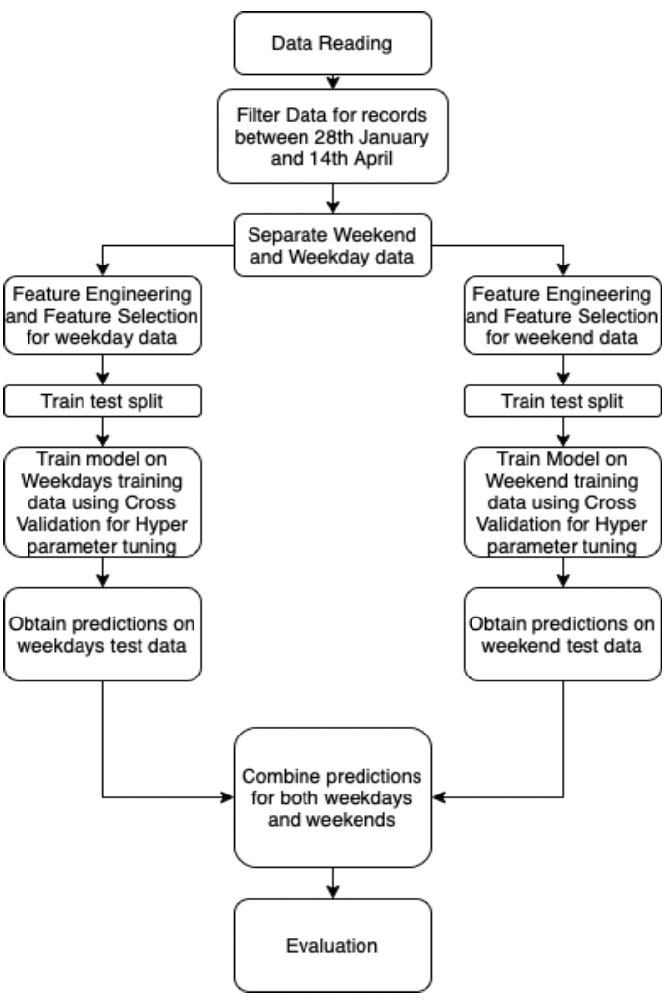

**Feature Engineering:**

The strategy that we will be following to come up with the most relevant features is to start with some basic features which captures various trends in the data. We will train a Linear Regression model using this data to predict 60 minutes into the future. Since in our data there is a time difference of 5 minutes between consecutive records, we will be predicting 12 steps ahead in the future. Coefficients will be compared to see which feature has the most impact on the predictions. The features with the highest coefficients will then be selected as the final input features.

**Feature Engineering for Weekdays:**

For Weekdays I will try to capture the weekly, daily and short term trends. It would have been helpful to consider the yearly trend too. However the data is available for only 3 months. For weekly predictions, we will take the data of the last 3 weeks. For daily predictions I will use the data of the last 3 days. For short term predictions I will use the value at current time and then bike station occupancy at 15 minutes and 30 minutes from current time. I have selected a time gap for 15 minutes for short term trends in order to avoid overlapping data.

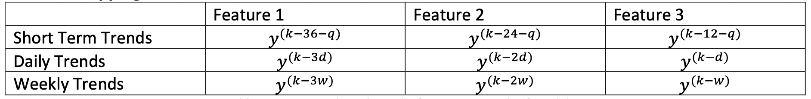

Where 𝑦k is the target value to be predicted

q is the number of steps to be predicted ahead( in our case 12)

d is the number of steps in one day. Considering the 5 minute gap there will be 24 x 60/5 = 288 steps w is the number of steps in one week which will be 7 x 288 = 2016.

We use a Lasso Regression model to identify the collinear columns in the data.

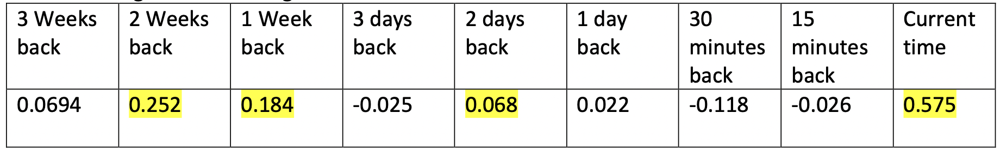

From table above, the bike station occupancy at the current time, 2 days back, 1 week back and 2 weeks back have the most impact on the model. Hence we will be using only these four features for our predictions.

**Feature Engineering for Weekends:**

For Weekends we will only consider the weekly and short term trends. Daily trend is not considered to make sure that weekday data is not included in the features.

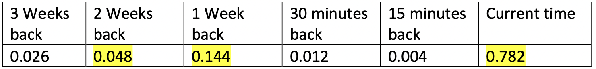

From Table above, the bike station occupancy at the current time, 1 week back and 2 weeks back have the most impact on the model. I will using only these 3 features for our predictions.

**Ridge Regression Model:**

To capture the non-linear relationship between the input features and target, powers of the actual features are used. Cross validation is performed to identify which power gives better results. The powers used are 1, 2, 3, 4 in order to ensure that a good range of powers are checked.
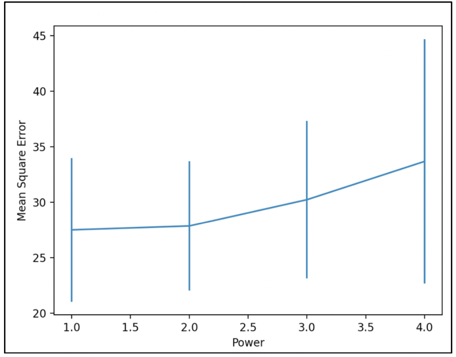
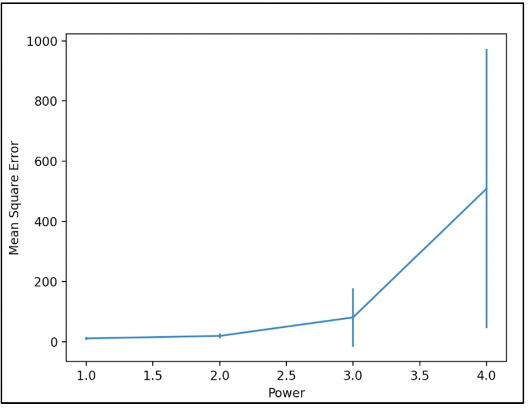

In Figure 4, the mean square error at power 1 and 2 is almost similar and is much less than at 3 and 4. With increasing values of the power, the model is becoming overfitted to the data. Power 2 will be selected for the training the weekdays data as it has less deviation as compared to power 1.
Similarly in Figure 5, the mean square error at power 1 is the lowest after which it keeps on increasing indicating overfitting to the data. Hence power 1 will be selected for training the weekend data.

Hyper-parameter Tuning:

5 – fold cross validation is used for Hyperparameter tuning. 5- fold is taken to ensure that there are enough samples to estimate distribution and also not high enough to increase computation time. We have selected the values of the hyperparameter(C) to be [0.001, 0.1, 1, 10]. This is done to ensure that we test over a wide range of values of C

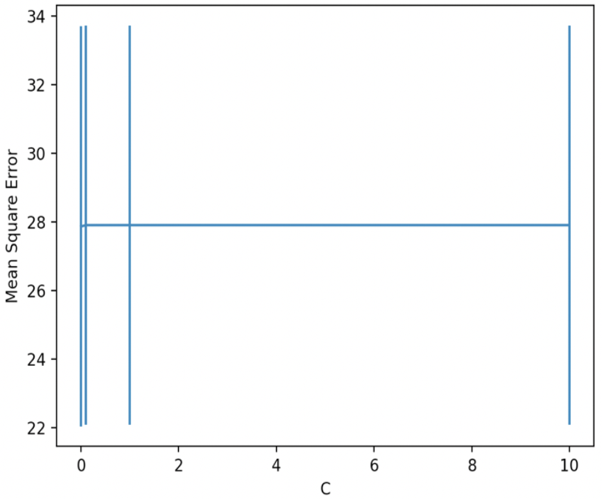
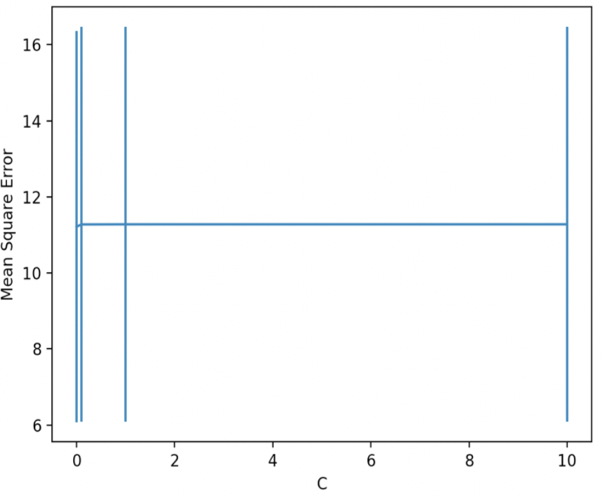

Figures 6 and 7 indicate that for both weekday data and weekend data, for C = 0.001, the mean square error is the lowest after which it increases slightly. Hence we will select C = 0.001.

**KNN Regression:**

Because of the visible trends in the data, we can directly use our data to give predictions. For this, we will be using a Knn Regression model. We will using Gaussian distance as the distance parameter in order to smoothen out the predictions

Cross Validation:

We will be performing k-Fold Cross Validation to obtain both the number of nearest neighbours and the kernel width(𝛾).

Weekday Tuning:

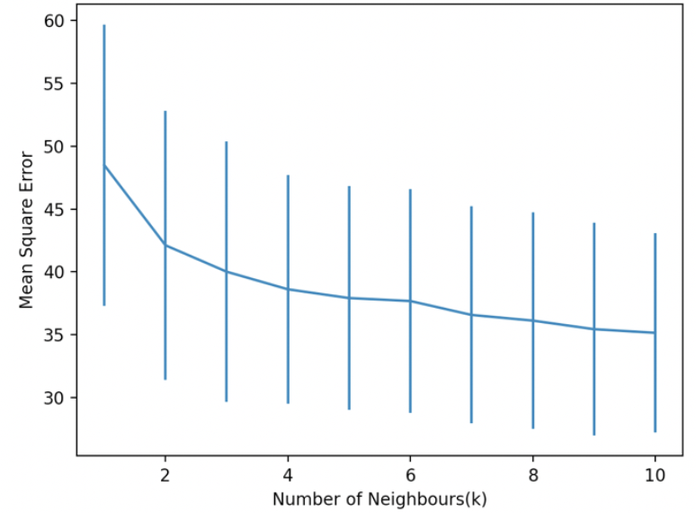
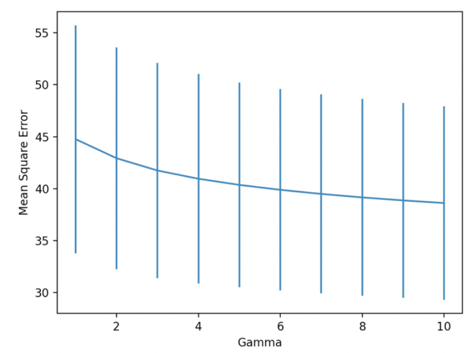

From Figure 8, the mean square error is less at 8 and further it only decreases slightly. Hence to avoid overfitting we will select k as 8. From Figure 9, we will select the kernel width as 6 since mean square error does not decrease much after that.

Weekend Tuning:

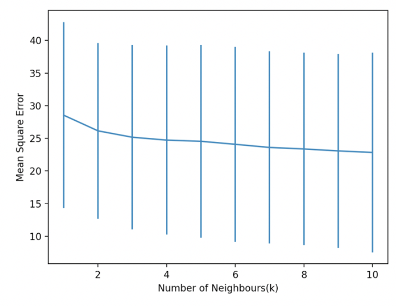
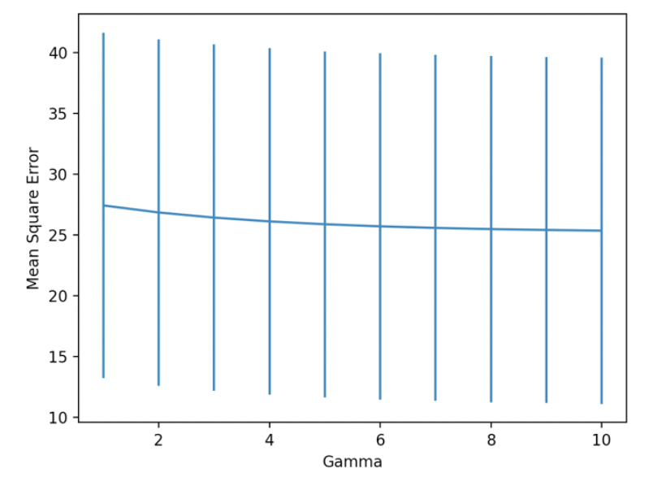

**Evaluation:**
 
The performance metrics of both the weekend and weekday data is obtained first. Predictions from both the models used for weekday data and weekend data are then combined together for the final evaluation. The metrics are compared with a Baseline Model which assumes that the bike station occupancy q steps ahead will be the same as it is right now.

Final Metrics:

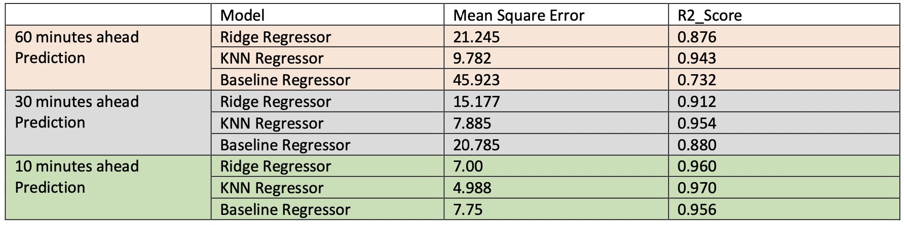

Plot of Prediction vs actual number of bikes in next 60 minutes for Hanover Quay using Ridge Regression:

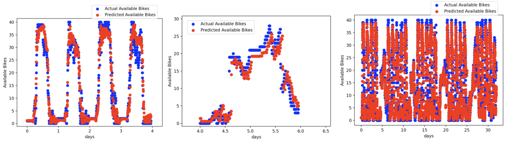

Plot of Prediction vs actual number of bikes in next 60 minutes for Hanover Quay using KNN Regression:

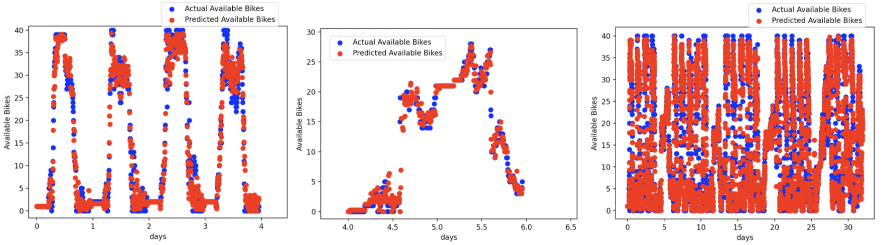
